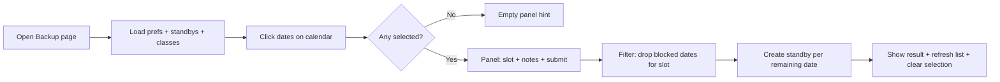

# Backup & Availability — Multi-Date Selection

Implementation plan for letting instructors select **multiple calendar dates at once** when opting in as backup standby.

> **Phase 0 (2026-06-03):** Recon complete — no product code changed. See **[docs/phase-0-recon.md](./docs/phase-0-recon.md)**. Source already has `selectedDays` + batch submit; confirm behavior on live/staging before re-implementing Phases 1–3.

**Related context:** Antigravity chat transcript in  
`DONOT DO ANY CHANGES_when I GIVE ACCESS TO AN INSTRUCTOR_...md`  
**Page:** `/instructor/availability` → `frontend/src/pages/instructor/BackupAvailability.tsx`  
**API:** `backend/app/routers/availability.py`

---

## 1. Problem statement

| Today | Target |
|--------|--------|
| Instructor clicks one date → side panel opens for that day only | Instructor clicks **many dates** on the calendar, picks **one** slot (Morning / Evening / Both), submits once |
| One API call per opt-in action (implicit) | One submit action creates standby rows for **all eligible** selected dates |
| — | Dates with an existing **class** in that slot are skipped (not submitted) |
| — | Dates fully blocked (AM + PM class) are not selectable |

This does **not** change general teaching preference (Morning / Evening / Both / None) or the standby list UI — only the **Opt-in as Backup** calendar flow.

---

## 2. What already exists (baseline)

From the prior Antigravity session, the repo may already contain partial work:

- **Calendar** monthly grid with class/standby dots (red/orange = class, blue/purple = standby).
- **`BackupAvailability.tsx`** may already use `selectedDays: Set<string>` instead of a single `popupDay`.
- **Submit** may loop `createStandbySlot()` per date via `Promise.all`.
- **Backend** `POST /api/availability/standby` accepts one row per request (`start_date`, `end_date`, `slot`, `notes`).
- **Class blocking** via `classMap` built from `getClasses('upcoming')` + `time_of_day` → morning/evening.

**First step when implementing:** confirm running UI matches this plan. If the live app still behaves as single-date, treat Phase 1 as **verify + finish** the multi-select UX, not greenfield.

---

## 3. Scope

### In scope

- Multi-select on calendar (click to toggle; clear selection).
- Side panel driven by **selection set** (count, sorted date list, slot radios, notes, single submit).
- Per-date skip when chosen slot conflicts with scheduled class.
- Success feedback: “Opted-in for N dates · M skipped”.
- Refresh standby list after submit.

### Out of scope (later ideas)

- Shift+click / drag range select (Phase 4 optional).
- Bulk delete of multiple standby slots.
- Module-based filtering for standby (separate roadmap in context doc).
- Slack auto-notify / claim-class widgets.

### No database migration required

`backup_availability` already stores one row per date range; multi-date opt-in = **multiple rows** with `start_date === end_date` (same as today).

---

## 4. User flow (target)



**Selection rules**

- Past dates: not clickable.
- Both AM and PM class that day: not clickable (fully blocked).
- Toggle click: add/remove date from `selectedDays`.
- Changing slot radio updates which dates show as “will skip” in the list.

**Submit rules**

- `availableCount = selectedDays.size - dates blocked for panelSlot`.
- If `availableCount === 0`, disable submit (“All dates blocked”).
- Same optional `notes` applied to every created row (current behavior).

---

## 5. Phased implementation

### Phase 1 — Multi-select state & calendar UX

**Goal:** Calendar supports many selected days with clear visual feedback.

| File | Changes |
|------|---------|
| `BackupAvailability.tsx` | Replace single-day popup state with `selectedDays: Set<string>`. `toggleDay(iso)` add/remove. `clearSelection()`. Highlight selected cells (border + background). Subtitle: “Click one or more dates…”. |
| — | Disable past + fully-blocked days. Keep dot legend. |

**Acceptance**

- [ ] Can select 2+ future dates in the same month.
- [ ] Click again deselects.
- [ ] × or clear resets selection.
- [ ] Selected dates visible on calendar.

---

### Phase 2 — Selection panel (multi-date)

**Goal:** Side panel reflects the **set** of dates, not one day.

| Area | Behavior |
|------|----------|
| Empty state | “Click one or more dates on the calendar…” |
| Header | “N dates selected” + close/clear |
| Date list | Scrollable, sorted ISO list; strikethrough + AM/PM badges if slot will be skipped |
| Slot radios | Morning / Evening / Both; disable option if **all** selected dates block that slot; show “skip K” when partial |
| Notes | Single textarea (optional) |
| Submit | Label: `Opt-in for N date(s)`; disabled when N=0 or submitting |

**Acceptance**

- [ ] Panel updates as selection changes.
- [ ] Switching slot updates skip preview per date.
- [ ] Warning when some dates will be skipped.

---

### Phase 3 — Batch create (frontend)

**Goal:** One button creates all eligible standbys.

| Approach | Detail |
|----------|--------|
| **v1 (minimal)** | `Promise.all` over `createStandbySlot({ start_date: iso, end_date: iso, slot, notes })` for each non-blocked date. |
| Error handling | Collect failures; show partial success (“3 created · 1 failed”). |
| After success | `fetchData()`, clear `selectedDays` after ~2.5s, show green banner |

**Acceptance**

- [ ] Selecting 5 valid dates + Morning creates 5 rows (if no duplicates).
- [ ] Mixed month selection works (e.g. Jun 5 + Jun 12 + Jul 1).
- [ ] Dates with morning class skipped when Morning selected.

**Note:** No backend change required for v1.

---

### Phase 4 — Backend bulk endpoint (recommended)

**Goal:** One HTTP round-trip, consistent validation, easier duplicate handling.

| File | Changes |
|------|---------|
| `availability.py` | `POST /api/availability/standby/bulk` — body: `{ dates: string[], slot, notes? }` |
| — | Validate each date; skip or reject duplicates (same instructor + date + overlapping slot). |
| — | Return `{ created: [...], skipped: [{ date, reason }], errors: [...] }` |
| `client.ts` | `createStandbySlotsBulk(...)` |
| `BackupAvailability.tsx` | Call bulk API instead of N× `createStandbySlot` |

**Acceptance**

- [ ] 10 dates → 1 request.
- [ ] Duplicate standby for same date+slot returns `skipped`, not 500.
- [ ] Invalid date in array does not fail entire batch (document policy: all-or-nothing vs partial — recommend **partial**).

---

### Phase 5 — UX polish (optional)

| Enhancement | Description |
|-------------|-------------|
| Cross-month selection | Keep `selectedDays` when changing `viewMonth` / `viewYear` (verify not cleared on nav). |
| Range select | Shift+click from anchor date to end date (select contiguous range). |
| Already on standby | Grey out or badge dates that already have active standby for chosen slot; skip on submit. |
| Remove per date | Small × on each row in panel list to remove one date from selection |

---

### Phase 6 — Verification & regression

| Check | |
|-------|---|
| General preference save | Still works independently |
| My Standby Slots list | Updates after multi opt-in |
| Admin replacement dropdown | Still reads `getAdminAvailabilityAll()`; new rows appear for matching date+slot |
| Mobile / narrow layout | Calendar + panel stack (`flexWrap`) |
| Typecheck | `npx tsc --noEmit` in `frontend/` |

---

## 6. Edge cases

| Case | Expected behavior |
|------|-------------------|
| Both AM & PM class | Day not selectable |
| Only AM class | Evening + Both allowed; Morning skipped |
| Only PM class | Morning + Both allowed; Evening skipped |
| `both` slot + any class | That date skipped for “Both” |
| Duplicate standby | Phase 4: skip with reason; Phase 3: surface API error per date |
| Network failure mid-batch | Show partial result; user can re-select failed dates |
| `both` slot creates one row | DB row with `slot: 'both'` (unchanged) |

---

## 7. Files touched (by phase)

| Phase | Files |
|-------|--------|
| 1–3 | `frontend/src/pages/instructor/BackupAvailability.tsx` |
| 4 | `backend/app/routers/availability.py`, `frontend/src/api/client.ts`, `BackupAvailability.tsx` |
| 5–6 | Mostly `BackupAvailability.tsx`; manual QA on admin flow |

---

## 8. API reference (current)

```
GET  /api/availability/me
POST /api/availability/standby          # single row
DELETE /api/availability/standby/{id}
PUT  /api/availability/preferences
GET  /api/availability/admin/all      # admin
```

**Proposed (Phase 4):**

```
POST /api/availability/standby/bulk
Body: { "dates": ["2026-06-05", "2026-06-12"], "slot": "evening", "notes": "" }
Response: { "created": 2, "skipped": 0, "items": [...] }
```

---

## 9. Success criteria

1. Instructor can select **multiple** future dates on the calendar in one session.
2. One submit applies the **same** slot (+ optional notes) to all non-blocked selections.
3. Class conflicts are visible **before** submit and enforced **on** submit.
4. Standby list and admin “On Standby” tags reflect new rows without extra steps.

---

## 10. Implementation order

```
Phase 1 → Phase 2 → Phase 3 → (ship MVP)
         ↘ Phase 4 when batch size or duplicate errors matter
         ↘ Phase 5–6 as time allows
```

**MVP = Phases 1–3** (frontend-only multi-select + parallel POSTs).  
**Production hardening = Phase 4** (bulk API + duplicate rules).
